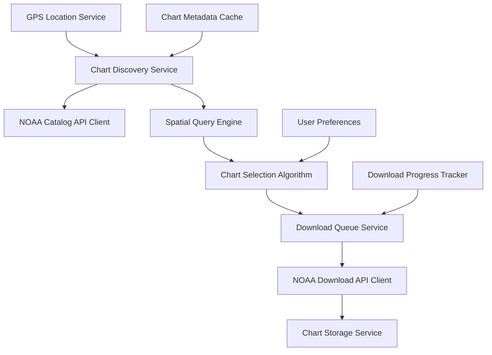

# Chart Service Specification
## NOAA Vector Chart Discovery and Download Service

*Version 1.0 | Created: August 27, 2025 | Based on OpenCPN patterns and NOAA API research*

---

## Executive Summary

This specification defines a comprehensive chart service for NavTool that automatically discovers and downloads NOAA vector charts based on GPS coordinates. The system implements proven patterns from OpenCPN's chart downloader plugin while leveraging NOAA's official ENC catalog API for coordinate-based chart selection.

**Key Features:**
- Automatic chart discovery based on GPS location
- Intelligent chart selection with scale-appropriate recommendations
- Bulk download management with queue system
- Real-time chart availability checking
- Integration with existing NavTool architecture using Riverpod state management

## 1. Technical Foundation

### 1.1 Research Findings

**OpenCPN Chart Downloader Analysis:**
- Uses NOAA Chart Catalog format for chart discovery
- Implements geographic coordinate search via chart boundary polygons
- Supports both raster and vector chart types (S-57 ENC, CM93, etc.)
- Provides chart metadata parsing with update tracking
- Manages chart coverage areas with spatial intersection algorithms

**NOAA Vector Chart API Research:**
- **Primary Data Source**: NOAA Electronic Navigational Charts (ENCs) in S-57 format
- **Discovery Method**: ENC Catalog API (GeoJSON format) with polygon coverage areas
- **Update Frequency**: Daily weekday updates with automatic catalog refresh
- **Access Model**: Public domain data with no authentication required
- **Rate Limiting**: Recommended 5 requests/second for server stability

### 1.2 Core Technologies

```yaml
Backend Services:
  - NOAA ENC Catalog API (GeoJSON)
  - NOAA Chart Display Service (Esri REST/OGC WMS)
  - Official ENC Download endpoints

Data Formats:
  - Input: GPS coordinates (WGS84 decimal degrees)
  - Discovery: GeoJSON polygon coverage areas
  - Charts: S-57 ENC (.000 files in ZIP archives)
  - Metadata: Chart attributes, edition dates, scale information

Flutter Integration:
  - HTTP client with dio package
  - Riverpod for dependency injection and state management
  - SQLite for local chart metadata caching
  - Spatial algorithms for coordinate intersection
```

## 2. Service Architecture

### 2.1 Component Overview



### 2.2 Service Classes

```dart
// Core discovery service
class ChartDiscoveryService {
  Future<List<ChartInfo>> discoverChartsForLocation(
    double latitude, 
    double longitude, 
    {double radiusKm = 50.0}
  );
  
  Future<List<ChartInfo>> discoverChartsForBoundingBox(
    BoundingBox bbox
  );
  
  Future<ChartSelectionRecommendation> getRecommendedCharts(
    double latitude, 
    double longitude,
    NavigationContext context
  );
}

// NOAA API integration
class NoaaApiClient {
  Future<EncCatalogResponse> getEncCatalog();
  Future<ChartMetadata> getChartMetadata(String chartId);
  Future<Uint8List> downloadChart(ChartInfo chart);
  Future<List<ChartUpdate>> checkForUpdates(List<String> chartIds);
}

// Spatial analysis
class SpatialQueryEngine {
  List<ChartInfo> findChartsContainingPoint(
    double lat, 
    double lon, 
    List<ChartInfo> charts
  );
  
  List<ChartInfo> findChartsIntersectingBounds(
    BoundingBox bbox, 
    List<ChartInfo> charts
  );
  
  double calculateChartPriority(
    ChartInfo chart, 
    double lat, 
    double lon
  );
}

// Download management
class ChartDownloadService {
  Future<void> queueDownload(ChartInfo chart);
  Future<void> queueBulkDownload(List<ChartInfo> charts);
  Stream<DownloadProgress> watchDownloadProgress();
  Future<void> pauseDownload(String chartId);
  Future<void> resumeDownload(String chartId);
  Future<void> cancelDownload(String chartId);
}
```

## 3. Chart Discovery Algorithm

### 3.1 Location-Based Discovery Flow

```yaml
Input: GPS coordinates (lat, lon) + optional radius
Process:
  1. Validate coordinates (valid lat/lon range, reasonable precision)
  2. Fetch latest ENC catalog from NOAA (cached with TTL)
  3. Parse catalog polygon geometries
  4. Perform spatial intersection queries
  5. Filter charts by type and scale relevance
  6. Rank results by priority algorithm
  7. Return recommended chart selection

Output: Prioritized list of applicable charts
```

### 3.2 Spatial Intersection Algorithm

Based on OpenCPN's proven approach:

```dart
class ChartSpatialFilter {
  static List<ChartInfo> filterByLocation(
    double lat, 
    double lon,
    List<ChartInfo> availableCharts
  ) {
    final point = LatLng(lat, lon);
    final results = <ChartInfo>[];
    
    for (final chart in availableCharts) {
      // Use polygon-in-point test from chart coverage bounds
      if (isPointInPolygon(point, chart.coveragePolygon)) {
        results.add(chart);
      }
    }
    
    return results;
  }
  
  static bool isPointInPolygon(LatLng point, List<LatLng> polygon) {
    // Ray casting algorithm for polygon intersection
    // Implementation details...
  }
}
```

### 3.3 Chart Priority Ranking

Charts are ranked using the following criteria (adapted from OpenCPN logic):

```dart
enum ChartPriority {
  critical,    // Harbor charts for current location
  high,        // Approach charts for nearby areas
  medium,      // Coastal charts for regional coverage
  low,         // General charts for background coverage
  reference    // Overview charts for context
}

class ChartPriorityCalculator {
  static ChartPriority calculatePriority(
    ChartInfo chart,
    double userLat,
    double userLon,
    NavigationContext context
  ) {
    final distanceFromUser = calculateDistance(
      userLat, userLon, 
      chart.centerLat, chart.centerLon
    );
    
    // Priority based on scale and distance
    if (chart.usageBand == UsageBand.harbor && distanceFromUser < 5.0) {
      return ChartPriority.critical;
    } else if (chart.usageBand == UsageBand.approach && distanceFromUser < 15.0) {
      return ChartPriority.high;
    } else if (chart.usageBand == UsageBand.coastal && distanceFromUser < 50.0) {
      return ChartPriority.medium;
    } else {
      return ChartPriority.low;
    }
  }
}
```

## 4. Chart Selection User Experience

### 4.1 Automatic Selection Mode

When users enable GPS location services:

```yaml
Trigger: User location acquired
Action:
  1. Discover charts within 50km radius
  2. Automatically select critical and high priority charts
  3. Show notification: "Found 12 charts for your location"
  4. Provide options: "Download All", "Review Selection", "Settings"

User Options:
  - Download immediately (one-tap convenience)
  - Review and customize selection
  - Configure automatic download preferences
  - Set download restrictions (WiFi only, storage limits)
```

### 4.2 Manual Selection Interface

For users who prefer control over chart selection:

```yaml
Location Input Methods:
  - GPS position (current location)
  - Map point selection (tap to select)
  - Coordinate input (lat/lon entry)
  - Port/harbor search (by name)
  - Planning route (waypoint-based discovery)

Selection Interface:
  - Interactive map showing chart boundaries
  - List view with chart metadata
  - Filter controls (scale, type, update status)
  - Batch selection with smart recommendations
  - Download size estimation and storage impact
```

### 4.3 Smart Recommendations

The system provides intelligent recommendations based on usage patterns:

```dart
class ChartRecommendationEngine {
  ChartSelectionRecommendation getRecommendations(
    double lat, 
    double lon,
    NavigationContext context
  ) {
    final discovered = discoverChartsForLocation(lat, lon);
    
    return ChartSelectionRecommendation(
      essential: filterEssentialCharts(discovered, context),
      recommended: filterRecommendedCharts(discovered, context),
      optional: filterOptionalCharts(discovered, context),
      downloadSize: calculateTotalSize(discovered),
      storageRequired: estimateStorageNeeds(discovered),
    );
  }
  
  List<ChartInfo> filterEssentialCharts(
    List<ChartInfo> charts, 
    NavigationContext context
  ) {
    // Harbor and approach charts for immediate vicinity
    return charts.where((chart) => 
      chart.usageBand.isEssential && 
      chart.distanceFromUser < 10.0
    ).toList();
  }
}
```

## 5. Download Management

### 5.1 Download Queue System

Implements robust download management adapted from OpenCPN patterns:

```dart
class DownloadQueueManager {
  final Queue<DownloadTask> _pendingDownloads = Queue();
  final Map<String, DownloadProgress> _activeDownloads = {};
  
  Future<void> addToQueue(ChartInfo chart) async {
    final task = DownloadTask(
      chartId: chart.id,
      url: chart.downloadUrl,
      expectedSize: chart.fileSize,
      priority: calculatePriority(chart),
    );
    
    _pendingDownloads.add(task);
    notifyListeners();
    
    if (_activeDownloads.length < maxConcurrentDownloads) {
      _startNextDownload();
    }
  }
  
  Future<void> _downloadChart(DownloadTask task) async {
    try {
      final response = await _httpClient.download(
        task.url,
        onProgress: (received, total) {
          _updateProgress(task.chartId, received, total);
        }
      );
      
      await _verifyChartIntegrity(response.data);
      await _storeChart(task.chartId, response.data);
      _markDownloadComplete(task.chartId);
      
    } catch (error) {
      _handleDownloadError(task.chartId, error);
    }
  }
}
```

### 5.2 Download Progress Tracking

```dart
class DownloadProgress {
  final String chartId;
  final String chartName;
  final int bytesDownloaded;
  final int totalBytes;
  final DownloadStatus status;
  final DateTime startTime;
  final Duration? estimatedTimeRemaining;
  final String? errorMessage;
  
  double get progressPercentage => 
    totalBytes > 0 ? (bytesDownloaded / totalBytes) * 100 : 0;
    
  double get downloadSpeedBytesPerSecond => 
    bytesDownloaded / DateTime.now().difference(startTime).inSeconds;
}

enum DownloadStatus {
  queued,
  downloading,
  paused,
  completed,
  failed,
  cancelled
}
```

### 5.3 Error Handling and Retry Logic

Following OpenCPN's robust error handling patterns:

```dart
class DownloadErrorHandler {
  static const maxRetryAttempts = 3;
  static const retryDelaySeconds = [5, 15, 60]; // Exponential backoff
  
  Future<void> handleDownloadError(
    String chartId,
    Exception error,
    int attemptNumber
  ) async {
    if (attemptNumber < maxRetryAttempts) {
      final delay = Duration(seconds: retryDelaySeconds[attemptNumber]);
      await Future.delayed(delay);
      
      // Retry download with exponential backoff
      await _retryDownload(chartId, attemptNumber + 1);
    } else {
      // Mark as failed and notify user
      _markDownloadFailed(chartId, error);
      _showUserNotification('Chart download failed: ${error.toString()}');
    }
  }
}
```

## 6. Data Models

### 6.1 Chart Information Model

```dart
class ChartInfo {
  final String id;                    // NOAA chart identifier
  final String name;                  // Chart title
  final String number;                // Chart number (e.g., "12354")
  final UsageBand usageBand;          // Harbor/Approach/Coastal/General/Overview
  final int scale;                    // Chart scale (1:20000)
  final BoundingBox coverageBounds;   // Geographic coverage area
  final List<LatLng> coveragePolygon; // Detailed coverage polygon
  final DateTime editionDate;         // Chart edition date
  final DateTime lastUpdate;          // Last update date
  final int fileSize;                 // Download size in bytes
  final String downloadUrl;           // Direct download URL
  final ChartFormat format;           // S-57, etc.
  final List<String> regions;         // Associated regions/states
  final ChartMetadata metadata;       // Additional chart attributes
  
  // Calculated properties
  double get centerLat => coverageBounds.center.latitude;
  double get centerLon => coverageBounds.center.longitude;
  double get areaSquareKm => coverageBounds.areaSquareKm;
  String get scaleDescription => '1:${NumberFormat('#,###').format(scale)}';
}

enum UsageBand {
  harbor,     // Largest scale, port details
  approach,   // Medium scale, harbor approaches
  coastal,    // Coastal navigation
  general,    // Regional overview
  overview;   // Smallest scale, planning
  
  bool get isEssential => this == UsageBand.harbor || this == UsageBand.approach;
  int get priorityWeight => 5 - index; // Harbor=5, Overview=1
}

class BoundingBox {
  final double north, south, east, west;
  
  LatLng get center => LatLng(
    (north + south) / 2,
    (east + west) / 2
  );
  
  double get areaSquareKm => calculateGeographicArea(north, south, east, west);
  
  bool contains(double lat, double lon) =>
    lat >= south && lat <= north && lon >= west && lon <= east;
}
```

### 6.2 Chart Selection Recommendation

```dart
class ChartSelectionRecommendation {
  final List<ChartInfo> essential;     // Must-have charts
  final List<ChartInfo> recommended;   // Should-have charts  
  final List<ChartInfo> optional;      // Nice-to-have charts
  final int totalDownloadSize;         // Total MB required
  final double storageRequired;        // Estimated storage after extraction
  final Duration estimatedDownloadTime;
  final RecommendationReasoning reasoning;
  
  List<ChartInfo> get allCharts => [...essential, ...recommended, ...optional];
  int get totalChartCount => allCharts.length;
}

class RecommendationReasoning {
  final String primaryReason;         // "Harbor charts for current location"
  final List<String> secondaryReasons; // Additional context
  final Map<String, int> chartsByType; // Count by usage band
  final double coverageRadius;         // Km radius covered
}
```

## 7. Integration with Existing NavTool Architecture

### 7.1 Riverpod Provider Integration

```dart
// Chart discovery providers
final chartDiscoveryServiceProvider = Provider<ChartDiscoveryService>((ref) {
  final apiClient = ref.read(noaaApiClientProvider);
  final spatialEngine = ref.read(spatialQueryEngineProvider);
  final storage = ref.read(chartStorageServiceProvider);
  
  return ChartDiscoveryService(
    apiClient: apiClient,
    spatialEngine: spatialEngine,
    storage: storage,
  );
});

// Current location chart recommendations
final locationBasedChartsProvider = FutureProvider.family<
  ChartSelectionRecommendation, LatLng
>((ref, location) async {
  final discoveryService = ref.read(chartDiscoveryServiceProvider);
  return discoveryService.getRecommendedCharts(
    location.latitude, 
    location.longitude,
    NavigationContext.recreational, // Default context
  );
});

// Download queue state
final downloadQueueProvider = StateNotifierProvider<
  DownloadQueueNotifier, DownloadQueueState
>((ref) {
  return DownloadQueueNotifier(
    ref.read(chartDownloadServiceProvider)
  );
});
```

### 7.2 Service Registration

```dart
// Configure services in main app initialization
class ChartServiceModule {
  static void configure(ProviderContainer container) {
    // HTTP client with rate limiting
    container.read(httpClientProvider.overrideWith(
      Provider((ref) => Dio()
        ..interceptors.add(RateLimitInterceptor(maxRequestsPerSecond: 5))
        ..interceptors.add(RetryInterceptor(maxRetries: 3))
      )
    ));
    
    // NOAA API client
    container.read(noaaApiClientProvider.overrideWith(
      Provider((ref) => NoaaApiClient(
        httpClient: ref.read(httpClientProvider),
        baseUrl: 'https://nauticalcharts.noaa.gov/api',
        cacheManager: ref.read(cacheManagerProvider),
      ))
    ));
    
    // Other service configurations...
  }
}
```

## 8. Performance and Caching Strategy

### 8.1 Multi-Level Caching

```dart
class ChartCacheManager {
  // Level 1: In-memory cache for active chart data
  final MemoryCache<String, ChartInfo> _memoryCache;
  
  // Level 2: SQLite cache for chart metadata
  final SqliteCache _metadataCache;
  
  // Level 3: File system cache for downloaded charts
  final FileSystemCache _chartFileCache;
  
  Future<List<ChartInfo>> getCachedChartsForRegion(
    BoundingBox region
  ) async {
    // Try memory cache first
    final memoryKey = _generateRegionKey(region);
    if (_memoryCache.containsKey(memoryKey)) {
      return _memoryCache.get(memoryKey)!;
    }
    
    // Fall back to database cache
    final dbResults = await _metadataCache.queryChartsInRegion(region);
    if (dbResults.isNotEmpty) {
      _memoryCache.put(memoryKey, dbResults);
      return dbResults;
    }
    
    // Cache miss - need to fetch from API
    return [];
  }
}
```

### 8.2 Spatial Indexing

```dart
class SpatialIndex {
  // Use R-tree spatial index for efficient chart lookup
  final RTree<ChartInfo> _spatialIndex = RTree();
  
  void buildIndex(List<ChartInfo> charts) {
    _spatialIndex.clear();
    for (final chart in charts) {
      _spatialIndex.insert(
        chart,
        Rectangle(
          chart.coverageBounds.west,
          chart.coverageBounds.south,
          chart.coverageBounds.east,
          chart.coverageBounds.north,
        )
      );
    }
  }
  
  List<ChartInfo> queryPoint(double lat, double lon) {
    return _spatialIndex.search(Point(lon, lat));
  }
  
  List<ChartInfo> queryRegion(BoundingBox bounds) {
    return _spatialIndex.search(Rectangle(
      bounds.west, bounds.south,
      bounds.east, bounds.north,
    ));
  }
}
```

## 9. Testing Strategy

### 9.1 Unit Tests

```dart
group('Chart Discovery Service', () {
  test('should discover charts for valid coordinates', () async {
    // Given
    const lat = 37.7749; // San Francisco Bay
    const lon = -122.4194;
    
    // When
    final result = await chartDiscoveryService.discoverChartsForLocation(lat, lon);
    
    // Then
    expect(result, isNotEmpty);
    expect(result.any((chart) => chart.usageBand == UsageBand.harbor), isTrue);
  });
  
  test('should return empty list for land coordinates', () async {
    // Given
    const lat = 39.7392; // Denver, Colorado (land)
    const lon = -104.9903;
    
    // When
    final result = await chartDiscoveryService.discoverChartsForLocation(lat, lon);
    
    // Then
    expect(result, isEmpty);
  });
});
```

### 9.2 Integration Tests

```dart
group('NOAA API Integration', () {
  testWidgets('should handle API rate limiting gracefully', (tester) async {
    // Test rapid successive API calls
    final futures = List.generate(20, (_) => 
      noaaApiClient.getEncCatalog()
    );
    
    final results = await Future.wait(futures);
    
    // Verify all calls succeeded despite rate limiting
    expect(results.every((r) => r.isSuccess), isTrue);
  });
});
```

### 9.3 Performance Tests

```dart
group('Spatial Query Performance', () {
  test('should handle large chart datasets efficiently', () async {
    // Given: Large dataset (10,000+ charts)
    final charts = await loadLargeChartDataset();
    final spatialEngine = SpatialQueryEngine();
    
    // When: Perform coordinate lookup
    final stopwatch = Stopwatch()..start();
    final results = spatialEngine.findChartsContainingPoint(
      37.7749, -122.4194, charts
    );
    stopwatch.stop();
    
    // Then: Should complete within performance threshold
    expect(stopwatch.elapsedMilliseconds, lessThan(100)); // Sub-100ms
    expect(results, isNotEmpty);
  });
});
```

## 10. Security and Reliability

### 10.1 Data Validation

```dart
class ChartDataValidator {
  static bool isValidCoordinate(double lat, double lon) {
    return lat >= -90 && lat <= 90 && lon >= -180 && lon <= 180;
  }
  
  static bool isValidChartData(Uint8List chartData) {
    // Verify S-57 file format headers
    return chartData.length > 0 && 
           _hasValidS57Header(chartData) &&
           _passesIntegrityCheck(chartData);
  }
  
  static Future<bool> verifyDownloadIntegrity(
    String expectedHash,
    Uint8List downloadedData
  ) async {
    final actualHash = await _calculateSHA256(downloadedData);
    return actualHash == expectedHash;
  }
}
```

### 10.2 Error Recovery

```dart
class ChartServiceErrorRecovery {
  Future<void> handleServiceFailure(ServiceFailureType type) async {
    switch (type) {
      case ServiceFailureType.networkTimeout:
        await _enableOfflineMode();
        await _notifyUserOfNetworkIssues();
        break;
        
      case ServiceFailureType.apiRateLimit:
        await _backoffAndRetry();
        break;
        
      case ServiceFailureType.invalidResponse:
        await _fallbackToCache();
        break;
        
      case ServiceFailureType.storageFailure:
        await _handleStorageCleanup();
        break;
    }
  }
}
```

## 11. Future Enhancements

### 11.1 Advanced Features

```yaml
Planned Enhancements:
  - Machine learning for smart chart recommendations based on usage patterns
  - Predictive downloading for planned routes
  - Collaborative chart sharing between NavTool users
  - Integration with weather routing for chart relevance
  - Automatic chart updates with delta downloads
  - Support for international chart sources (Canada, UK, etc.)

Technical Improvements:
  - WebAssembly spatial calculations for enhanced performance
  - Progressive chart loading for large datasets
  - Differential sync for chart metadata updates
  - Advanced compression for reduced storage requirements
```

### 11.2 Analytics and Monitoring

```dart
class ChartServiceAnalytics {
  void trackChartDiscovery(
    LatLng location,
    int chartsFound,
    Duration responseTime
  );
  
  void trackDownloadSuccess(
    String chartId,
    Duration downloadTime,
    int fileSize
  );
  
  void trackUserSelection(
    List<ChartInfo> recommended,
    List<ChartInfo> userSelected
  );
}
```

---

## Conclusion

This specification provides a comprehensive foundation for implementing coordinate-based chart discovery and download in NavTool. The design leverages proven patterns from OpenCPN while adapting to modern Flutter architecture and NOAA's current API offerings.

The system prioritizes reliability and user experience in marine environments, with robust error handling, intelligent caching, and seamless integration with existing NavTool components. The modular architecture enables incremental implementation and future enhancements while maintaining high performance standards required for marine navigation applications.

**Implementation Priority:**
1. Core discovery service with NOAA API integration
2. Spatial query engine with basic chart selection
3. Download management and progress tracking
4. User interface integration with recommendation engine
5. Advanced features and performance optimizations

**Estimated Development Timeline:** 6-8 weeks for complete implementation with comprehensive testing.